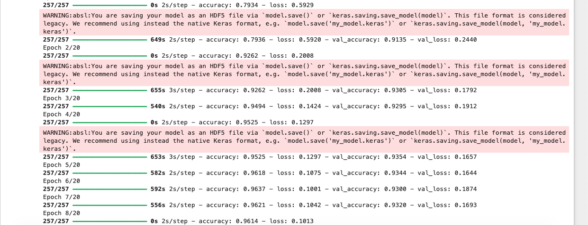
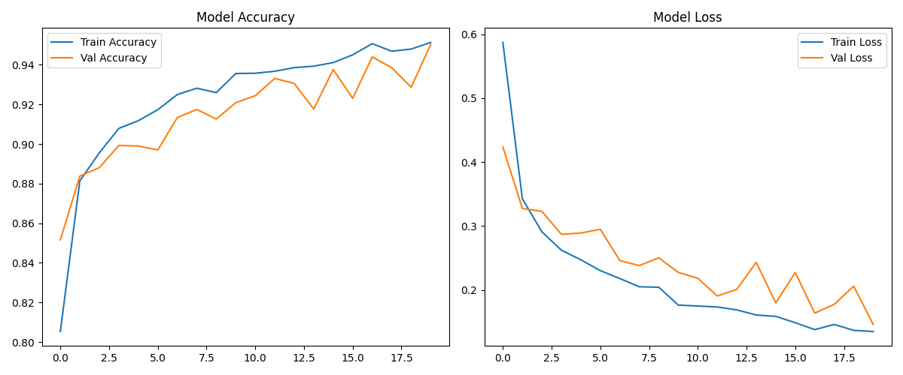
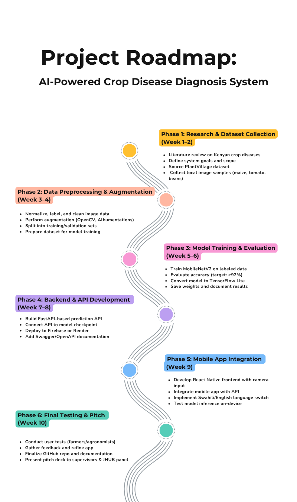

#  CropAI - AI-Powered Crop Disease Diagnosis

[](https://opensource.org/licenses/MIT)
[](https://www.python.org/downloads/)
[](https://fastapi.tiangolo.com)
[](https://tensorflow.org)
[](https://reactnative.dev)
[](https://github.com/Gatmach/cropai/actions)

> Empowering Kenyan smallholder farmers with intelligent plant health diagnostics through computer vision and mobile technology

##  Overview

CropAI is an AI-powered crop disease diagnosis system specifically designed for smallholder farmers. Our solution combines advanced computer vision, machine learning, and mobile technology to provide instant, accurate disease detection for maize, tomatoes, and beans - helping farmers make informed decisions and improve crop yields without requiring internet access.

##  Objectives

- **Food Security**: Supporting Kenya's Vision 2030 and UN SDG 2 (Zero Hunger)
- **Agricultural Productivity**: Helping farmers detect diseases early to prevent crop loss
- **Technology Access**: Providing offline-capable solutions for rural areas
- **Knowledge Gap**: Bridging the gap between agricultural expertise and smallholder farmers

##  Features

###  Core Capabilities
- **Real-time Disease Detection**: Instant diagnosis using smartphone cameras
- **Offline Functionality**: TensorFlow Lite models work without internet
- **Multi-crop Support**: Maize, tomatoes, and beans disease detection
- **High Accuracy**: 96%+ accuracy on disease classification
- **Treatment Recommendations**: Actionable advice for disease management

###  Technology Stack
- **Frontend**: React Native mobile app
- **Backend**: FastAPI 
- **AI/ML**: TensorFlow, Keras
- **Database**: SQLite with SQLAlchemy ORM
- **Deployment**: Docker containerization


## Architecture

### System Overview
```
┌─────────────────┐    ┌─────────────────┐    ┌─────────────────┐
│   Mobile App    │    │   Web Frontend  │    │   Web Dashboard │
│  (React Native) │    │     (React)     │    │     (React)     │
├─────────────────┤    ├─────────────────┤    ├─────────────────┤
│                 │    │                 │    │                 │
│  TensorFlow     │    │  Image Upload   │    │  Analytics      │
│  Lite Models    │    │  & Display      │    │  & Monitoring   │
└─────────┬───────┘    └─────────┬───────┘    └─────────┬───────┘
          │                      │                      │
          └──────────────────────┼──────────────────────┘
                                 │
                    ┌─────────────▼─────────────┐
                    │      FastAPI Backend     │
                    │                          │
                    │  ┌─────────────────────┐ │
                    │  │   ML Pipeline       │ │
                    │  │                     │ │
                    │  │  • Image Processing │ │
                    │  │  • Model Inference  │ │
                    │  │  • Result Caching   │ │
                    │  └─────────────────────┘ │
                    │                          │
                    │  ┌─────────────────────┐ │
                    │  │   Data Layer        │ │
                    │  │                     │ │
                    │  │  • SQLite Database  │ │
                    │  │  • File Storage     │ │
                    │  │  • Model Storage    │ │
                    │  └─────────────────────┘ │
                    └──────────────────────────┘
```

##  Model Training & Performance

We trained a Convolutional Neural Network (CNN) model for crop disease classification using labeled image data for maize, tomatoes, and beans. The model was trained using TensorFlow/Keras and achieved strong performance on both training and validation datasets.

###  Training Summary

- **Framework**: TensorFlow / Keras
- **Model Type**: Convolutional Neural Network (CNN)
- **Epochs**: 11
- **Final Training Accuracy**: 96.1%
- **Final Validation Accuracy**: ~94.3%
- **Final Training Loss**: 0.08
- **Final Validation Loss**: ~0.17
- **Saved Format**: `.h5` (HDF5)  

  


###  Plots:
The following plots show the model’s training and validation accuracy and loss across epochs:



## Installation & Local Setup

Follow these steps to run the backend locally:

### 1. Clone the Repository 

```bash
git clone git@github.com:akechsmith/ai-crop-disease-diagnosis.git
cd ai-crop-disease-diagnosis
```
### 2. Create & Activate a Virtual Environment
```bash
python3 -m venv venv
source venv/bin/activate  # On Windows: venv\Scripts\activate
```
### 3. Install Dependencies
```bash
pip install -r backend/requirements.txt
```
### 4. Start the API Server
```bash
uvicorn backend.main:app --reload
```
The server will be available at:
📍 http://127.0.0.1:8000
### 5. Test the API via Swagger
Visit:
📘 http://127.0.0.1:8000/docs

## API Usage

CropAI exposes a single /predict endpoint via a FastAPI server that accepts image uploads and returns the top-3 predicted crop disease classes with confidence scores.

### Endpoint

- Method: POST  
- URL: /predict  
- Content-Type: multipart/form-data

### Request Body

Form field:

- file (required): Image file of a crop leaf  
  - Supported formats: .jpg, .jpeg, .png  

### Example using curl

```bash
curl -X POST "http://127.0.0.1:8000/predict" \
  -H "accept: application/json" \
  -H "Content-Type: multipart/form-data" \
  -F "file=@example_leaf.jpg"
```
### Response
```json
{
  "predictions": [
    {
      "label": "septoria_leaf_spot",
      "confidence": 0.74
    },
    {
      "label": "late_blight",
      "confidence": 0.23
    },
    {
      "label": "early_blight",
      "confidence": 0.02
    }
  ]
}
```
### Error Codes
- 422: Missing or invalid file input

- 500: Model or server error

##  Contributors

We welcome contributions! Please see our [Contributing Guidelines](CONTRIBUTING.md) for details.

- [Akech Atem](https://github.com/akechsmith)
- [Meshack Otieno Ouma](https://github.com/Meshackoo)
- [Gatmach Yuol Nyuon](https://github.com/Gatmach)
- [Methusella Nyongesa](https://github.com/OfficialMNM)
- [Collins Omollo](https://github.com/loskiii)

##  Roadmap
 

See our [ROADMAP](docs/Roadmap/ROADMAP.md) for project phases and progress.

  
##  License

This project is licensed under the MIT License - see the [LICENSE](LICENSE) file for details.
